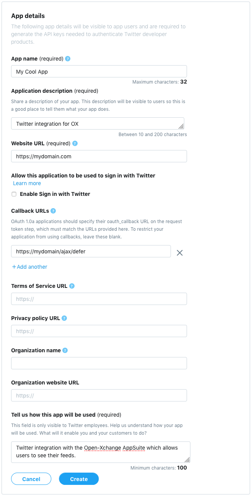
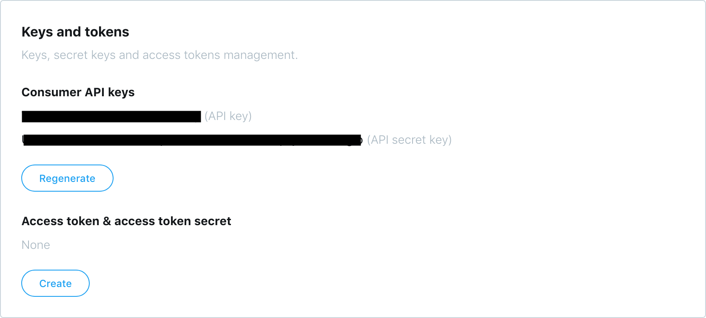

# Installation

To enable the Twitter support for the AppSuite, alongside the `open-xchange-oauth` package you will also need to install the `open-xchange-messaging` package via your OS's package manager.

# Register your App

First you will need to register an App with Twitter. Apply for a [developer account](https://developer.twitter.com/en/docs/basics/developer-portal/overview) and once granted, then create an App as described [here](https://developer.twitter.com/en/docs/basics/apps/overview).

Refer to the following screenshots for a minimal App with only the required fields.

Enter the appropriate information for: 
 
 * *App name*
 * *Application description*
 * *Website URL*
 * *Callback URLs*
 * *Tell us how this app will be used* 

**Note**: the callback URL has to use the `https` protocol and end with the `/ajax/defer` path. 

Click on *Create*

When the application is successfully created, [access tokens](https://developer.twitter.com/en/docs/basics/authentication/guides/access-tokens), i.e. the consumer API key and secret will be automatically created for you. You can view those under the *Keys and Access Tokens* tab.

Those tokens will be used to configure the AppSuite (that is the individual nodes of the middleware) that should have access to this Twitter App.

A last step is required to ensure that the user will only view the latest Tweets and not post any new ones. For that, you will have to navigate to the *Permissions* tab and set the *Access permission* to *Read-only*.

# Configuration

After you have created your App, its [access tokens](https://developer.twitter.com/en/docs/basics/authentication/guides/access-tokens), i.e. the consumer API key and secret, should be available. The access tokens should be added to the `/opt/open-xchange/etc/twitteroauth.properties` file:

* Enable the OAuth connector to Twitter OAuth:
  `com.openexchange.oauth.twitter=true`
* Set the API key and secret:
   `com.openexchange.oauth.twitter.apiKey=REPLACE_THIS_WITH_YOUR_CLIENT_ID`
   `com.openexchange.oauth.twitter.apiSecret=REPLACE_THIS_WITH_YOUR_CLIENT_SECRET`

You can define them system-wide or via the config cascade mechanism.
