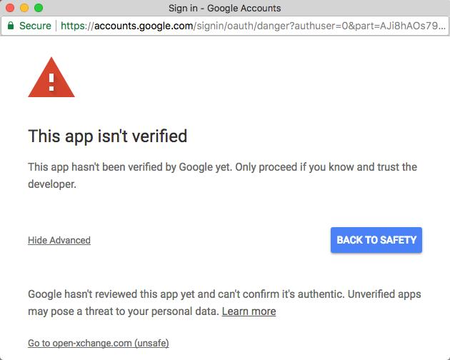

# Problem
Google has recently restricted the possibility to allow 3rd party developers to integrate their applications with Google services, see 
[this article](https://support.google.com/cloud/answer/7454865) for further information. In essence, a verification process was introduced that requires multiple 
steps to be taken. This change affects all Google integrations for OX App Suite:

* external mail accounts (if configured to use OAuth for Google)
* calendar
* address book
* OX Drive storage integration

Without verification, users will see a warning message instead of a login form in the authorization popups. While the warning itself can be ignored with some effort, 
also the number of users that might use a certain 3rd party app with Google gets limited.



# Solution
The following is necessary to avoid the limitations: (also see [Google's documentation](https://developers.google.com/apps-script/guides/client-verification#requesting_verification))

* In [Google Developer Console](https://console.developers.google.com/), ensure that the OAuth consent screen settings include a valid homepage URL and a 
publicly available privacy policy URL below the same domain.
* In [Google Search Console](https://www.google.com/webmasters/tools/home), ensure that the homepage URL is a verified property of the Google account that 
is used to obtained the API keys.
* Submit a verification request at Google

You need to specify the following scopes in the verification form, depending on which functionality you do offer. 
Unfortunately, every change of your offered feature set or changes by Open-Xchange might require re-verification in the future:

* https://mail.google.com/ (Read, send, delete, and manage users' email)
* https://www.googleapis.com/auth/calendar.readonly (View users' calendars)
* https://www.googleapis.com/auth/contacts.readonly (View users' contacts)
* https://www.googleapis.com/auth/drive (View and manage the files in the users' Google Drive)
* https://www.googleapis.com/auth/userinfo.profile (View the users' basic profile info, used to retrieve the users' unique identifiers)

Also, you need to provide an explanation why your instance of OX App Suite requires these scopes. A possible statement could be:

```
 With [Product Name], we offer email, personal information management
 and a cloud storage solution. We want to offer our users the possibility
 to use their respective Google account data from within our web
 application.
 - Our app uses scope https://mail.google.com/ to obtain an access token
   to authenticate to Gmails IMAP and SMTP servers via the XOAUTH2 SASL
   mechanism. The app allows users to integrate any IMAP account and offers a
   fully-fledged webmailer on top of it.
 - Scope https://www.googleapis.com/auth/contacts.readonly is used by our app
   to let users import contacts from their Google address book. Imports are
   periodically refreshed. The contacts are then used to make find-as-you-type
   suggestions when composing emails, creating appointments, etc.
 - We request scope https://www.googleapis.com/auth/calendar.readonly to let
   users import their appointments from Google Calendar into our own calendar
   application. Imports are periodically refreshed. The appointments can be
   viewed from within our web frontend.
 - The app uses https://www.googleapis.com/auth/drive to allow users to browse
   their Google Drive and manage files and folders. They also can select Google
   Drive files as attachments for eMails that are composed with our webmail
   module.
```

It might happen that despite submitting the verification request, you get no positive answer even after weeks. In that case please answer to the submit confirmation mail 
and ask for guidance on how to proceed to get your app verified. Google seems to react to these eMails. In our case, we were asked to again explain the requested scopes 
in more detail. After doing that, the app was verified within a day and the warning screen was gone.

