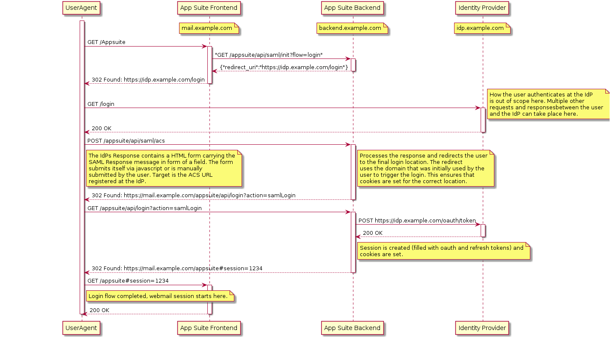

With version 7.8.4 the middleware supports OAuth authentication for the primary mail account via SAML Bearer Assertion Authorization Grant.
This document describes how to configure the middleware to use an rfc6749 compliant token endpoint to gain oauth token pairs.
Furthermore this document describes how to extend a custom SAML implementation to support OAuth authentication.


# How to configure the middleware against a token endpoint

**Prerequisite**:

* A running SAML configuration
* A running and configured mail server supporting oauthbearer authentication
* A running token endpoint supporting the SAML Bearer Assertion Authorization Grant and (optional) the Token Refresh Grant. E.g. via a running wso2 identity server.

Now you only need to configure the following properties:

```
com.openexchange.mail.authType=oauthbearer
com.openexchange.mail.transport.authType=oauthbearer

com.openexchange.saml.oauth.token = <the token endpoint url>
com.openexchange.saml.oauth.clientId = <the client id>
com.openexchange.saml.oauth.clientSecret = <the client secret>
```

For more informations about the properties see [mail configuration](https://documentation.open-xchange.com/components/middleware/config/develop/index.html#mode=features&feature=Mail) 
and [saml configuration](https://documentation.open-xchange.com/components/middleware/config/develop/index.html#mode=features&feature=Saml).

Once configured the flow is the following:




# How to adapt a custom SAML implementation

In order to support OAuth authentication with your custom SAML backend you need to adapt your own com.openexchange.saml.spi.SAMLBackend.

The properties map inside the com.openexchange.saml.spi.AuthenticationInfo object returned from the SAMLBackend needs to contain the following properties:

* com.openexchange.saml.AccessToken
* com.openexchange.saml.RefreshToken (optional)

You also need to define and register a com.openexchange.mail.api.AuthenticationFailedHandler with a service ranking > 100.
The AuthenticationFailedHandler should only refresh the access and refresh tokens in case the AuthType of the MailConfig is an OAuth type.
If the AuthType is an OAUTH type the following steps must be followed:

1. Obtain new OAuth tokens
2. Update the corresponding session parameters
3. Update the password of the MailConfig with the new access tokens
4. Store the session via the SessiondService
5. Return with "return AuthenticationFailureHandlerResult.createRetryResult();"

If the AuthenticationFailedHandler is unable to refresh the tokens it should remove the session and return with an SESSION_EXPIRED exception.

E.g.:

```Java
public class OAuthFailedAuthenticationHandler implements AuthenticationFailedHandler {
    @Override
    public AuthenticationFailureHandlerResult handleAuthenticationFailed(OXException failedAuthentication, Service service, MailConfig mailConfig, Session session) throws OXException {
      if( AuthType.isOAuthType(mailConfig.getAuthType())){
          SessiondService sessiondService = Services.getService(SessiondService.class);
          if(session.containsParameter(Session.PARAM_OAUTH_REFRESH_TOKEN)){
              // try to get new tokens here
              session.setParameter(Session.PARAM_OAUTH_ACCESS_TOKEN, accessToken);
              session.setParameter(Session.PARAM_OAUTH_REFRESH_TOKEN, refreshToken);
              mailConfig.setPassword(accessToken);
              sessiondService.storeSession(session.getSessionID());
              return AuthenticationFailureHandlerResult.createRetryResult();
          }
          // Unable to refresh access token -> logout
          sessiondService.removeSession(session.getSessionID());
          return AuthenticationFailureHandlerResult.createErrorResult(SessionExceptionCodes.SESSION_EXPIRED.create(session.getSessionID()));
      }
      return AuthenticationFailureHandlerResult.createContinueResult();
    }
}
```
