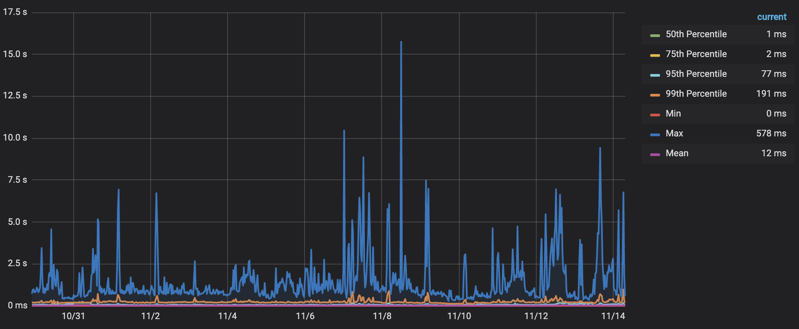
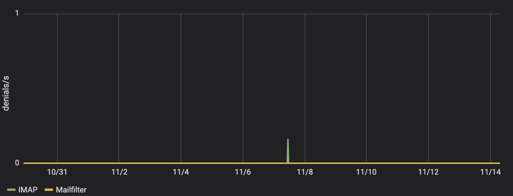

# Introduction

Whenever the App Suite middleware relies on an external component to complete an incoming client request, the overall response time mainly depends on the actual response of the external component. For example, when there is some higher load on the IMAP server, and due to the high load, the response latency increases, this leads to an increased response time for the requests to the middleware. Each of those handled requests consumes resources (threads, memory), which directly impacts the general responsiveness of the Java process.

Moreover, if requests aren't returned in a timely fashion by the middleware node, the user or client might issue them again after a proxy timeout was encountered, leading to more stalled requests as they're waiting for the external component, too. Or, the load balancer could even decide that the middleware node is not responding properly anymore, and as a consequence, begins to route requests to other middleware nodes, which in turn will forward the incoming requests to the same external subsystem under load, so that the problem gets cascaded throughout all nodes in the cluster.

A common pattern to survive such situations is a so-called Circuit Breaker - a logical piece within the stack that detects or tracks failures in external systems and prevents the application from trying to perform an action repeatedly where it is known that it will fail, prior trying again after some backoff time. 

Since v7.10.3, such a Circuit Breaker is available for connections to IMAP endpoints and mail filter endpoints respectively. It is disabled by default, but can be activated after some parameters of the target environment have been evaluated. This article describes some basic principles of the implementation and provides guidelines for enabling the feature.

# How it works

It is common for software systems to make remote calls to services on different machines across a network. One of the big differences between in-memory calls and remote calls is that remote calls can fail, or hang without a response until some timeout limit is reached. If you have many callers on an unresponsive service, you can run out of critical resources leading to cascading failures across multiple systems.

The basic idea behind the circuit breaker is very simple. You wrap a protected call in a circuit breaker instance, which monitors for failures. Once the failures reach a certain threshold, the circuit breaker trips. Meaning its state transitions from closed to open and all further calls to the circuit breaker return with an error, without the protected call being made at all.

When the circuit breaker is open, it checks after a certain delay if the underlying calls are working again by allowing one or more protected calls being performed for probing (success rate). Its state is then set to half-open. If that probing fails, state turns back to open and delay is reset. If probing is successful, the state transitions to closed allowing further protected calls being executed.

# Installation

The circuit breaker for connections to IMAP and mail filter endpoints ships with package `open-xchange-imap` and `open-xchange-mailfilter` respectvely. No further packages need to be installed.

# Configuration

## Generic IMAP circuit breaker

First, there is a generic IMAP circuit breaker that applies to all IMAP end-points being connected to.

- `com.openexchange.imap.breaker.enabled` The flag to enable/disable the generic IMAP circuit breaker. Default is `false`
- `com.openexchange.imap.breaker.failureThreshold` The failure threshold; which is the number of successive failures that must occur in order to open the circuit. Default is `5`
- `com.openexchange.imap.breaker.failureExecutions` The number of executions to measure the failures against. Default is the same setting as specified for `com.openexchange.imap.breaker.failureThreshold`
- `com.openexchange.imap.breaker.successThreshold` The success threshold; which is the number of successive successful executions that must occur when in a half-open state in order to close the circuit. Default is `2`
- `com.openexchange.imap.breaker.successExecutions` The number of executions to measure the successes against. Default is the same setting as specified for `com.openexchange.imap.breaker.successThreshold`
- `com.openexchange.imap.breaker.delayMillis` The delay in milliseconds; the number of milliseconds to wait in open state before transitioning to half-open. Default is `60000`

Example for generic circuit breaker config

```properties
com.openexchange.imap.breaker.enabled=true
# Open the circuit if 10 out of the last 20 executions result in a failure
com.openexchange.imap.breaker.failureThreshold=10
com.openexchange.imap.breaker.failureExecutions=20
# Close the circuit if 2 out of the last 5 executions were successful
com.openexchange.imap.breaker.successThreshold=2
com.openexchange.imap.breaker.successExecutions=5
com.openexchange.imap.breaker.delayMillis=60000
```

Furthermore, an administrator is allowed to specify overrides for either primary mail account or for named accounts.

## Specify the circuit breaker for primary account

Example for an override for the primary account using the `"primary"` infix. Since primary IMAP and mail filter are typically hosted by the same service endpoint, the circuit breaker for mail filter should be adjusted as well.

```properties
# Circuit breaker config for primary mail account
com.openexchange.imap.breaker.primary.enabled=true
com.openexchange.imap.breaker.primary.failureThreshold=5
com.openexchange.imap.breaker.primary.failureExecutions=10
com.openexchange.imap.breaker.primary.successThreshold=2
com.openexchange.imap.breaker.primary.successExecutions=5
com.openexchange.imap.breaker.primary.delayMillis=60000

# In case mail filter is also available, include mail filter as well
com.openexchange.mail.filter.breaker.failureThreshold=5
com.openexchange.mail.filter.breaker.failureExecutions=10
com.openexchange.mail.filter.breaker.successThreshold=2
com.openexchange.mail.filter.breaker.successExecutions=5
com.openexchange.mail.filter.breaker.delayMillis=60000
```

## Specify the circuit breaker for a named account

For each named circuit breaker the following options need to be configured:

- The host list to which the breaker applies
- The optional ports to consider for given host list
- The failure threshold; which is the number of successive failures that must occur in order to open the circuit
- The failure executions; which is the number number of executions to measure the failures against. Defaults to failure threshold
- The success threshold; which is the number of successive successful executions that must occur when in a half-open state in order to close the circuit
- The success executions; which is the number of executions to measure the successes against. Defaults to success threshold
- The delay in milliseconds; the number of milliseconds to wait in open state before transitioning to half-open

Specify these options for each named IMAP circuit breaker through:

- `com.openexchange.imap.breaker.` + [breaker-name] + `.enabled`
- `com.openexchange.imap.breaker.` + [breaker-name] + `.hosts`
- `com.openexchange.imap.breaker.` + [breaker-name] + `.ports`
- `com.openexchange.imap.breaker.` + [breaker-name] + `.failureThreshold`
- `com.openexchange.imap.breaker.` + [breaker-name] + `.failureExecutions`
- `com.openexchange.imap.breaker.` + [breaker-name] + `.successThreshold`
- `com.openexchange.imap.breaker.` + [breaker-name] + `.successExecutions`
- `com.openexchange.imap.breaker.` + [breaker-name] + `.delayMillis`

Example for an override through a named circuit breaker

```properties
com.openexchange.imap.breaker.gmail.enabled=true
com.openexchange.imap.breaker.gmail.hosts=imap.gmail.com, imap.googlemail.com
com.openexchange.imap.breaker.gmail.ports=
com.openexchange.imap.breaker.gmail.failureThreshold=10
com.openexchange.imap.breaker.gmail.successThreshold=2
com.openexchange.imap.breaker.gmail.delayMillis=60000
```

# Monitoring

There are several ways to collect metrics from `JMX`, in this example we will keep focus on a plugin-in driven server agent called [Telegraf](https://github.com/influxdata/telegraf). This agent offers the [jolokia2](https://github.com/influxdata/telegraf/tree/master/plugins/inputs/jolokia2) input plugin to read JMX metrics from one or more Jolokia agent REST endpoints.

## Response times & failure rates

With the following `MBeans` it's possible to track response times and failure rates:

- `com.openexchange.metrics.imap`
  - `errorRate`: Failed `IMAP` request meter per target server.
  - `requestRate`: Overall `IMAP` request timer per target server.
- `com.openexchange.metrics.mailfilter`
  - `errorRate`: Failed `mail filter` request meter per target server.
  - `requestRate`: Overall `mail filter` request timer per target server.

This could be the `Jolokia Metric Configuration` to read the response times and failure rates from the `MBeans`:

```plaintext
  [[inputs.jolokia2_agent.metric]]
    mbean = "com.openexchange.metrics:name=*Rate,type=*,server=*"
    name = "ox_circuit_breaker"
    tag_keys = ["type", "server", "name"]
```

and the graphical visualization in `Grafana`:

- Error & Request Rate


- Response Times



## Status, configuration settings, trip count & denials per circuit breaker

With the following `MBean` it's possible to track some circuit breaker specific metrics or settings:

- `com.openexchange.metrics.circuit-breakers`
  - `delayMillis`: The number of milliseconds to wait in open state before transitioning to half-open.
  - `denialsMeter`: The occurrences when an access attempt has been denied because circuit breaker is currently open and thus not allowing executions to occur.
  - `failureThreshold`: The number of successive failures that must occur in order to open the circuit.
  - `status`: The current status of the circuit breaker.
  - `successThreshold`: The number of successive successful executions that must occur when in a half-open state in order to close the circuit.
  - `tripCount`: The number representing how often the circuit breaker tripped.

The `Jolokia Metric Configuration` to read for example the status or the denials from the `MBean` could be:

```plaintext
  [[inputs.jolokia2_agent.metric]]
    mbean = "com.openexchange.metrics:name=denialsMeter,type=circuit-breakers,account=*,protocol=*"
    name = "ox_circuit_breaker"
    paths = ["Count"]
    tag_keys = ["name", "type", "protocol", "account"]

  [[inputs.jolokia2_agent.metric]]
    mbean = "com.openexchange.metrics:name=status,type=circuit-breakers,account=*,protocol=*"
    name = "ox_circuit_breaker"
    tag_keys = ["name", "type", "protocol", "account"]
```

and how it could be visualized:

- Denials



## Example Configuration

Full example configuration of the [jolokia2](https://github.com/influxdata/telegraf/tree/master/plugins/inputs/jolokia2) plugin to collect all `Circuit-Breaker` related metrics:

### Jolokia Agent

```plaintext
[[inputs.jolokia2_agent]]
  urls = ["http://${MIDDLEWARE_NODE}:8009/monitoring/jolokia"]
  username = "${JOLOKIA_USER}"
  password = "${JOLOKIA_PASSWORD}"
```

### Jolokia Metrics

```plaintext
  [[inputs.jolokia2_agent.metric]]
    mbean = "com.openexchange.metrics:name=*Rate,type=*,server=*"
    name = "ox_circuit_breaker"
    tag_keys = ["type", "server", "name"]

  [[inputs.jolokia2_agent.metric]]
    mbean = "com.openexchange.metrics:name=denialsMeter,type=circuit-breakers,account=*,protocol=*"
    name = "ox_circuit_breaker"
    paths = ["Count"]
    tag_keys = ["name", "type", "protocol", "account"]

  [[inputs.jolokia2_agent.metric]]
    mbean = "com.openexchange.metrics:name=status,type=circuit-breakers,account=*,protocol=*"
    name = "ox_circuit_breaker"
    tag_keys = ["name", "type", "protocol", "account"]
```
