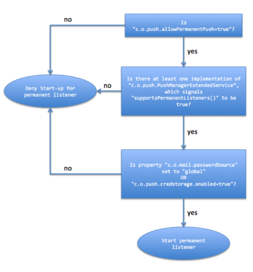
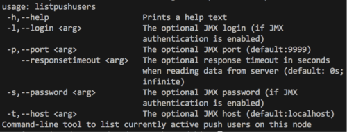

# Enable permanent mail push listeners
The existing mail push framework of the Open-Xchange Middleware has been extended by the capability to spawn "permanent" listeners for incoming new message deliveries. Up to that point the life cycle for a listener was bound to at least one active session, which is associated with a client that is allowed to receive mail push notifications.

With introduction of the previously mentioned capability, listeners can be started without the need for an existent session right on the start of an Open-Xchange Middleware node. In addition those permanent listeners are spread approximately even over capable cluster members as - dependent on the underlying implementation - a listener representation may open/hold resources (socket connections) in order to receive notifications about new message deliveries.

To prepare a certain Open-Xchange Middleware node to spawn permanent mail push listeners the following properties need to be configured in file ``/opt/open-xchange/etc/mail-push.properties``:

* ``com.openexchange.push.allowPermanentPush``
This is the general switch to enable/disable support for permanent listeners on a node. Thus needs to be set to "true"
* ``com.openexchange.push.allowedClient``
Specify the comma-separated list of clients which are allowed to receive notifications about new mails. Ensure that "open-xchange-mobile-api-facade*" is listed here in case new mail push is supposed to be setup for OX Mail v2 0.
* ``com.openexchange.push.credstorage.enabled``
As permanent listeners are required to run without an active session, the credential storage can be used to store user credentials in installations that do not support a master authentication to the mail storage. Hence, if the property ``com.openexchange.mail.passwordSource`` (``/opt/open-xchange/etc/mail.properties``) is not set to "global" this property is required to be set to "true"
* ``com.openexchange.push.credstorage.passcrypt``
This property is required if ``com.openexchange.push.credstorage.enabled`` is set to "true". It does specify the passphrase to use to symmetrically encrypt the stored credentials. The passphrase is required to be equal on each cluster member.
* ``com.openexchange.push.credstorage.rdb``
Once the credential storage is enabled, Open-Xchange offers two ways of storing the user-associated login/password combination. In cluster memory (default) or persisted to database. While the first way ensures that no user credentials are persisted anywhere in the Open-Xchange installation, it has the big disadvantage that stored credentials are gone once the last cluster member gets shut-down. Therefore there is also the possibility to store the credentials inside the database. Of course, no matter where the credentials are stored, they are encrypted using the value from ``com.openexchange.push.credstorage.passcrypt`` property

With setting the properties above the configuration on the Open-Xchange Middleware node is prepared to spawn permanent listeners for new mails.

Now an appropriate mail push bundle/package needs to be installed that supports spawning permanent listeners. Currently Open-Xchange ships with three implementations:

* ``open-xchange-push-dovecot`` (also requires the optional open-xchange-rest package)
* ``open-xchange-push-imapidle`` (Not recommended, therefore disabled for permanent listeners by default: ``com.openexchange.push.imapidle.supportsPermanentListeners`` is set to "false" by default)
* ``open-xchange-push-mailnotify``

This article is focussed on ``open-xchange-push-dovecot``.

Putting all together the following execution flow is taken to decide whether permanent listeners are spawned or not:



To check at any time what listeners are currently running, there is a new command-line tool ``/opt/open-xchange/sbin/listpushusers`` that outputs the user-id/context-id pair along-side with the information if the listener is of permanent nature or bound to an active session:



An exemplary out put might look like:

```
~# /opt/open-xchange/sbin/listpushusers
user=249, context=1, permanent=true
user=402, context=1, permanent=true
```

# Setup Dovecot Mail Push

Please see [here]({{ site.baseurl }}/middleware/mail/dovecot/Dovecot%20Push.html)

# Setup Web Sockets (if demanded)

Web Sockets are only relevant if new mail push should also be advertised to App Suite UI. In case new mail push is intended being setup for OX Mail v2 0, Web Sockets do not need to be setup. Please see [here]({{ site.baseurl }}/middleware/push/websockets.html) to check how to setup Web Sockets if new mail push to App Suite UI is demanded.

# Setup Push Notification Service

Please see [here]({{ site.baseurl }}/middleware/push/pns.html). As mentioned in previous chapter, the Web Sockets content of that artcile should only be considered if new mail push should also be advertised to App Suite UI. In case of OX Mail v2 0, only APNS and FCM/GCM transport need tio be considered.

# Setup for OX Mail v2 0

## Installation

* Install the ``open-xchange-pns-mobile-api-facade`` package

## Configuration

* [com.openexchange.pns.mobile.api.facade.apn.badge.enabled](/components/middleware/config{{ site.baseurl }}/index.html#com.openexchange.pns.mobile.api.facade.apn.badge.enabled)
Specifies if badges are enabled when using push notifications for the OX Mail app for iOS. These get displayed on the app icon. Default is "true"
* [com.openexchange.pns.mobile.api.facade.apn.sound.enabled](/components/middleware/config{{ site.baseurl }}/index.html#com.openexchange.pns.mobile.api.facade.apn.sound.enabled)
Specifies if a sound should be played when the OX Mail app on iOS receives a push notification.
* [com.openexchange.pns.mobile.api.facade.apn.sound.filename](/components/middleware/config{{ site.baseurl }}/index.html#com.openexchange.pns.mobile.api.facade.apn.sound.filename)
Specifies the filename of the sound to play when a push notification is received in the OX Mail app on iOS. This file needs to be included in the app, otherwise a default sound is played. The value default also causes the default iOS sound to be played.

## Setup new mail notifications to OX Mail v2 0

Please check [this](http://oxpedia.org/wiki/index.php?title=AppSuite:OX_Mail_v2_0) article to see how to setup OX Mail v2 0.

The new mail push setup requires a working OX App Suite and the [Mobile API Facade](http://oxpedia.org/wiki/index.php?title=AppSuite:Mobile_API_Facade).

There are two possible ways to setup notifications for new mails from the Middleware to the new OX Mail apps. One is to install the push configuration provideded in the ``open-change-mobile-api-facade-push-certificates`` package, the other is to configure everything manually.

### Push configuration provided by package

To be able to use the push configuration provideded in the open-change-mobile-api-facade-push-certificates pacakge its needed to enabled push notifications for Android and iOS in general first. This can be done in a file 'pns.properties' (which might need to be created first):

* ``com.openexchange.pns.transport.apn.ios.enabled=true``
General switch to enable/disable push notifications for iOS using the Apple APN service
* ``com.openexchange.pns.transport.gcm.enabled=true``
General switch to enable/disable push notifications for iOS using the Google FCM service

### Manually configuring push configurations

To manually configure push configurations for Android you need to configure a service key in the Google Firebase developer console, for iOS you need to request a certificate for push notifications in the Apple developer console.

Generally push notifications for both platforms needs to be enabled in the file 'pns.properties':

* ``com.openexchange.pns.transport.apn.ios.enabled=true``
General switch to enable/disable push notifications for iOS using the Apple APN service
* ``com.openexchange.pns.transport.gcm.enabled=true``
General switch to enable/disable push notifications for iOS using the Google FCM service
For Android the file 'pns-gcm-options.yml' needs to contain the following snippet with the proper server key: open-xchange-mobile-api-facade:

```
   enabled: true
   key: 1234567890123456789012345678901234567890
```

For Apple iOS the file 'pns-apns-options.yml' needs to contain the following snippet with the proper values:

```
open-xchange-mobile-api-facade:
    enabled: true
    keystore: /opt/open-xchange/etc/apns-certificate.p12
    password: 12345678
    production: true
```

The identifier ``open-xchange-mobile-api-facade`` might be different. When we provide multiple branded apps connecting to the same servers we append a specific string per brand, e.g. ``open-xchange-mobile-api-facade-brand1`` and ``open-xchange-mobile-api-facade-brand2``.

